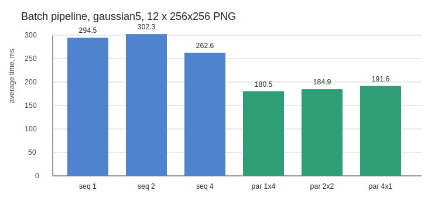

# Задание 3: потоковая обработка набора изображений

## Описание

Проект реализует свёртку цветных RGB-изображений и pipeline для обработки папки изображений:

- `reader` читает изображения и кладёт их в ограниченную очередь;
- несколько `convolution worker` применяют фильтр;
- `writer` сохраняет результат, сохраняя относительные пути файлов.

Очереди ограничены параметром `queueCapacity`, поэтому reader не может бесконечно забить память, если свёртка или запись работают медленнее чтения. Worker можно запускать в двух режимах:

- `sequential` — каждый worker обрабатывает своё изображение последовательной свёрткой;
- `parallel` — каждый worker дополнительно параллелит свёртку одного изображения стратегиями из задания 2: `pixels`, `rows`, `columns`, `grid`.

## Сборка и запуск

Требования:

- Git;
- Maven;
- Java 24.

Сборка:

```bash
mvn clean package
```

Обработка одного изображения из предыдущих заданий осталась доступна:

```bash
java -cp target/classes Main apply <input> <output> <filterName>
java -cp target/classes Main apply-parallel <input> <output> <filterName> <strategy> <threads>
```

Потоковая обработка папки:

```bash
java -cp target/classes Main apply-batch <inputDir> <outputDir> <filterName> <workers> <queueCapacity> <sequential|parallel> [strategy] [convolutionThreads]
```

Примеры:

```bash
java -cp target/classes Main apply-batch input output gaussian5 4 8 sequential
java -cp target/classes Main apply-batch input output gaussian5 2 8 parallel grid 4
```

Бенчмарк с учётом чтения, свёртки и записи:

```bash
java -cp target/classes Main benchmark-batch <inputDir> <outputDir> <filterName> <workers> <queueCapacity> <sequential|parallel> [strategy] [convolutionThreads] <iterations>
```

## Тестирование

Проверки из схемы задания покрыты так:

- последовательные тесты проверяют `identity`, нулевой фильтр, диапазон значений, размер результата и расширение ядра нулями;
- параллельные тесты сравнивают все стратегии с последовательной реализацией на случайных данных;
- batch-тесты сравнивают результат pipeline с последовательной свёрткой для каждого файла и проверяют сохранение относительных путей.

Запуск:

```bash
mvn test
```

В текущем окружении `mvn` не найден в `PATH`, поэтому основная часть дополнительно проверена компиляцией:

```bash
javac -encoding UTF-8 -d target/classes <src/main/java/**/*.java>
```

## Исследование производительности

Стенд:

- ОС: Windows;
- Java compiler: `javac 24`;
- входные данные: 12 синтетических PNG `256x256`;
- фильтр: `gaussian5`;
- очередь: `queueCapacity=2`;
- итераций на замер: `3`;
- в замер входят чтение, свёртка и запись.

CSV с результатами: [research/batch_benchmark.csv](research/batch_benchmark.csv).



| Режим | Workers | Внутренняя свёртка | Среднее время, мс |
|-------|--------:|--------------------|------------------:|
| `sequential` | 1 | нет | 294.519 |
| `sequential` | 2 | нет | 302.348 |
| `sequential` | 4 | нет | 262.622 |
| `parallel` | 1 | `grid`, 4 потока | 180.468 |
| `parallel` | 2 | `grid`, 2 потока | 184.917 |
| `parallel` | 4 | `grid`, 1 поток | 191.569 |

## Вывод

Для набора небольших изображений чтение и запись занимают заметную долю времени, поэтому простое увеличение количества worker’ов не всегда даёт линейный выигрыш. Лучший результат в этом прогоне дала схема `1 worker x 4 внутренних потока`: она ускорила обработку относительно базового `1 sequential worker` примерно в `1.63x`. Pipeline при этом ограничивает память очередями и позволяет независимо настраивать баланс между чтением, свёрткой и записью.
