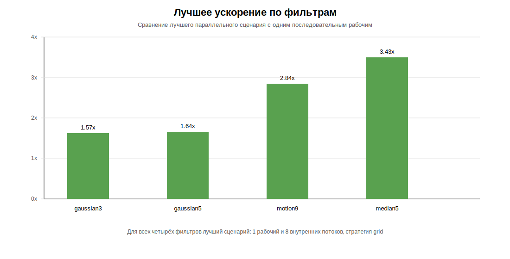
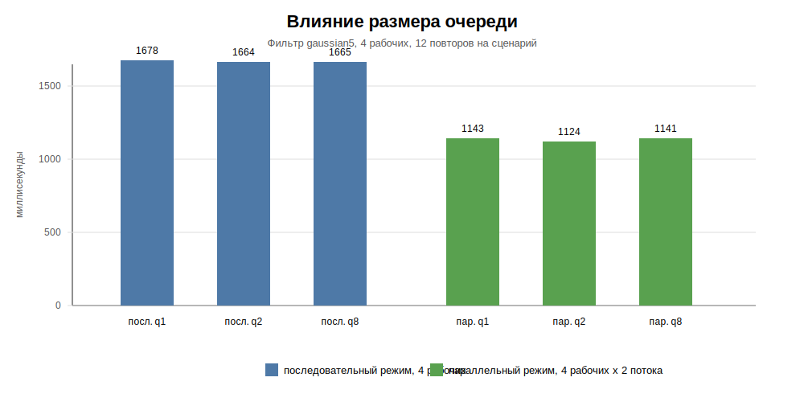
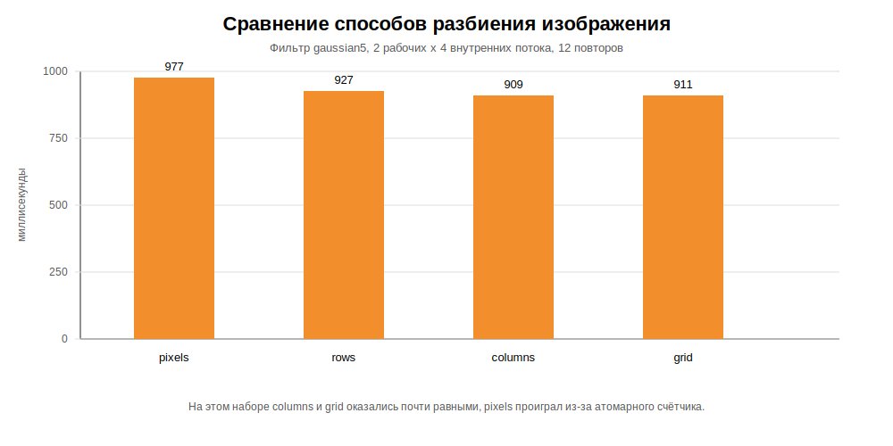
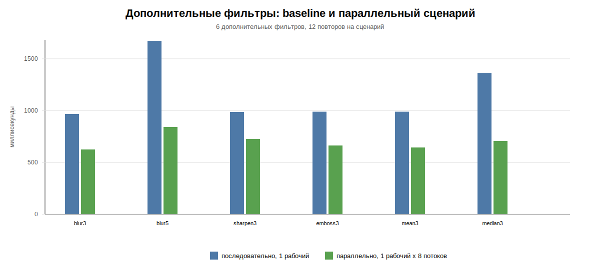

# Задание 3: потоковая обработка набора цветных изображений

## Описание

В этом проекте я реализовал потоковую обработку набора цветных RGB-изображений. Код из первых двух заданий используется как основа: последовательная свёртка остаётся baseline, а параллельная свёртка одного изображения может применяться внутри pipeline worker'ов.

Изображение хранится как плоский RGB-массив `width * height * 3`: для каждого пикселя подряд лежат каналы `R`, `G` и `B`. Свёртка и median filter применяются отдельно к каждому каналу, поэтому результат остаётся цветным.

Pipeline разделяет обработку на стадии:

- `reader` читает изображения из входной директории и кладёт их в ограниченную очередь;
- несколько `convolution worker` забирают изображения и применяют фильтр;
- `writer` сохраняет результат в выходную директорию, сохраняя относительные пути файлов.

Очереди ограничены параметром `queueCapacity`, поэтому reader не может бесконечно занять память, если свёртка или запись работают медленнее чтения.

Код разложен по пакетам:

- `image` — загрузка, сохранение и хранение RGB-изображения;
- `filter` — последовательные фильтры, ядра свёртки и median filter;
- `parallel` — параллельная обработка одного изображения и стратегии разбиения;
- `pipeline` — потоковая обработка директории: чтение, очереди, worker'ы и запись;
- `Main` — единая точка входа для запуска `java Main ...`.

## Сборка и запуск

Требования:

- Git;
- Maven;
- Java 24.

Сборка:

```bash
mvn clean package
```

Обработка одного изображения из предыдущих заданий:

```bash
java -cp target/classes Main apply <input> <output> <filterName>
java -cp target/classes Main benchmark <input> <filterName> <iterations>
```

Параллельная обработка одного изображения:

```bash
java -cp target/classes Main apply-parallel <input> <output> <filterName> <strategy> <threads>
java -cp target/classes Main benchmark-parallel <input> <filterName> <strategy> <threads> <iterations>
```

Потоковая обработка директории:

```bash
java -cp target/classes Main apply-batch <inputDir> <outputDir> <filterName> <workers> <queueCapacity> <sequential|parallel> [strategy] [convolutionThreads]
java -cp target/classes Main benchmark-batch <inputDir> <outputDir> <filterName> <workers> <queueCapacity> <sequential|parallel> [strategy] [convolutionThreads] <iterations>
```

Примеры:

```bash
java -cp target/classes Main apply-batch D:\temp output gaussian5 4 2 sequential
java -cp target/classes Main apply-batch D:\temp output gaussian5 2 2 parallel grid 4
```

## Поддерживаемые фильтры

- `identity`
- `blur3`
- `blur5`
- `gaussian3`
- `gaussian5`
- `gaussian3_exact`
- `motion9`
- `edge_horizontal5`
- `edge_vertical5`
- `edge_45deg5`
- `edge_all3`
- `sharpen3`
- `sharpen5`
- `edge_excessive3`
- `emboss3`
- `emboss5`
- `mean3`
- `median3`
- `median5`
- `median7`

## Режимы pipeline

| Режим | Идея |
|-------|------|
| `sequential` | Каждый worker обрабатывает своё изображение последовательной реализацией фильтра. |
| `parallel` | Каждый worker дополнительно параллелит обработку одного изображения стратегиями из задания 2. |

Внутри режима `parallel` доступны те же стратегии, что и во 2 задании:

| Стратегия | Идея |
|-----------|------|
| `pixels` | Потоки берут отдельные пиксели через общий атомарный счётчик. |
| `rows` | Изображение делится на горизонтальные полосы. |
| `columns` | Изображение делится на вертикальные полосы. |
| `grid` | Изображение делится на прямоугольную сетку блоков. |

## Тестирование

Проверяются основные свойства реализации:

- последовательная свёртка проверяется на `identity`, нулевом ядре, размере результата, диапазоне каналов и расширении ядра нулями;
- дополнительно проверяется композиция противоположных shift-фильтров до `identity` на разных размерах изображений;
- параллельная свёртка совпадает с последовательной для всех стратегий, разных размеров, фильтров и числа потоков;
- параллельный median filter совпадает с последовательным для разных окон и стратегий;
- batch pipeline совпадает с последовательной обработкой каждого файла;
- batch pipeline сохраняет относительные директории и игнорирует неподдерживаемые файлы.

Запуск тестов:

```bash
mvn test
```

В текущей среде Maven не был доступен в `PATH`, поэтому я дополнительно проверил компиляцию через `javac 24` и запуск тестов через JUnit Platform Launcher. Результат: `19 tests successful`.

## Исследование производительности

Параметры стенда взяты из второго задания, на той же машине и тех же изображениях:

- ОС: Windows 11 Pro;
- CPU: 11th Gen Intel(R) Core(TM) i7-11370H @ 3.30 GHz;
- RAM: 16 ГБ;
- Java runtime: Java 24;
- компиляция проекта: Java 22 в `pom.xml`, фактическая проверка через `javac 24`;
- изображения: `256.png`, `512.jpg`, `1024.jpg`, `2048.jpg` из локальной папки `D:\temp`;
- фильтры: `gaussian3`, `gaussian5`, `motion9`, `median5`;
- режимы pipeline: `sequential` и `parallel`;
- worker'ы pipeline: `1`, `2`, `4`, `8`;
- внутренние потоки в parallel-режиме: `1`, `2`, `4`, `8`;
- стратегии внутренней параллельной свёртки: `pixels`, `rows`, `columns`, `grid`;
- размеры очереди: `1`, `2`, `8`;
- число повторов каждого сценария: `12`;
- всего сценариев: `54`;
- всего batch-запусков: `648`;
- всего обработок изображений в исследовании: `2592`;
- всего использовано фильтров: `10` из `19` перечисленных в README;
- в замер входят чтение, свёртка и запись.

Исходные фотографии в репозиторий не добавлены. В `research` сохранены только CSV с результатами и графики.

CSV с результатами: [research/batch_benchmark.csv](research/batch_benchmark.csv).

### Графики










### Gaussian5: баланс worker'ов и внутренних потоков

В этой таблице `1x8` означает `1 pipeline worker x 8 внутренних потоков`, `2x4` означает `2 pipeline worker x 4 внутренних потока`.

| Режим | Workers | Внутренняя свёртка | Среднее время, мс | Ускорение |
|-------|--------:|--------------------|------------------:|----------:|
| `sequential` | 1 | нет | 1646.317 | 1.00x |
| `sequential` | 2 | нет | 1620.411 | 1.02x |
| `sequential` | 4 | нет | 1609.169 | 1.02x |
| `sequential` | 8 | нет | 1972.423 | 0.83x |
| `parallel` | 1 | `grid`, 8 потоков | 1006.328 | 1.64x |
| `parallel` | 2 | `grid`, 4 потока | 1091.058 | 1.51x |
| `parallel` | 4 | `grid`, 2 потока | 1294.698 | 1.27x |
| `parallel` | 8 | `grid`, 1 поток | 1721.389 | 0.96x |

### Лучшие результаты по фильтрам

| Фильтр | Baseline: `sequential`, 1 worker, мс | Лучший parallel-сценарий | Лучшее время, мс | Ускорение |
|--------|-------------------------------------:|--------------------------|-----------------:|----------:|
| `gaussian3` | 976.281 | `1x8`, `grid` | 623.463 | 1.57x |
| `gaussian5` | 1646.317 | `1x8`, `grid` | 1006.328 | 1.64x |
| `motion9` | 4607.868 | `1x8`, `grid` | 1619.819 | 2.84x |
| `median5` | 4968.215 | `1x8`, `grid` | 1448.162 | 3.43x |

### Sequential worker'ы по фильтрам

| Фильтр | 1 worker, мс | 2 workers, мс | 4 workers, мс | 8 workers, мс |
|--------|-------------:|--------------:|--------------:|--------------:|
| `gaussian3` | 976.281 | 950.794 | 940.542 | 930.721 |
| `gaussian5` | 1646.317 | 1620.411 | 1609.169 | 1972.423 |
| `motion9` | 4607.868 | 3955.743 | 3939.715 | 3953.744 |
| `median5` | 4968.215 | 4221.760 | 4286.343 | 4003.382 |

### Parallel worker'ы по фильтрам

| Фильтр | 1x8, мс | 2x4, мс | 4x2, мс | 8x1, мс |
|--------|--------:|--------:|--------:|--------:|
| `gaussian3` | 623.463 | 649.608 | 714.982 | 952.147 |
| `gaussian5` | 1006.328 | 1091.058 | 1294.698 | 1721.389 |
| `motion9` | 1619.819 | 2190.745 | 2774.044 | 4257.469 |
| `median5` | 1448.162 | 1749.056 | 2592.250 | 4001.361 |

### Сравнение способов разбиения

Условия: `gaussian5`, `2 pipeline worker x 4 внутренних потока`, `queueCapacity=2`.

| Стратегия | Среднее время, мс |
|-----------|------------------:|
| `pixels` | 976.770 |
| `rows` | 927.160 |
| `columns` | 908.970 |
| `grid` | 911.149 |

### Влияние размера очереди

| Конфигурация | Queue | Среднее время, мс |
|--------------|------:|------------------:|
| `sequential`, 4 workers | 1 | 1677.722 |
| `sequential`, 4 workers | 2 | 1663.831 |
| `sequential`, 4 workers | 8 | 1665.075 |
| `parallel`, 4 workers x 2 threads | 1 | 1143.136 |
| `parallel`, 4 workers x 2 threads | 2 | 1123.994 |
| `parallel`, 4 workers x 2 threads | 8 | 1141.206 |

### Дополнительная проверка фильтров

Чтобы исследование использовало не только один-два фильтра, дополнительно проверены ещё 6 фильтров. Вместе с основным прогоном это 10 фильтров из 19 перечисленных в README.

| Фильтр | `sequential`, 1 worker, мс | `parallel`, 1x8, мс | Ускорение |
|--------|---------------------------:|--------------------:|----------:|
| `blur3` | 967.996 | 623.552 | 1.55x |
| `blur5` | 1674.386 | 841.589 | 1.99x |
| `sharpen3` | 985.602 | 724.904 | 1.36x |
| `emboss3` | 991.483 | 664.325 | 1.49x |
| `mean3` | 991.018 | 644.823 | 1.54x |
| `median3` | 1364.801 | 704.473 | 1.94x |

## Вывод

На наборе из четырёх изображений `256.png`, `512.jpg`, `1024.jpg`, `2048.jpg` простое увеличение количества pipeline worker'ов даёт ограниченный эффект. Причина в том, что файлов всего четыре, а самое большое изображение доминирует по времени: нескольким worker'ам сложно равномерно загрузиться, если каждый worker обрабатывает изображение целиком.

Самый стабильный выигрыш дала схема `1 worker x 8 внутренних потоков`: она параллелит тяжёлую свёртку внутри одного изображения и поэтому лучше подходит для набора, где мало файлов, но есть крупные изображения. Для `median5` ускорение достигло `3.43x`, для `motion9` — `2.84x`, для `gaussian5` — `1.64x`. На дополнительных фильтрах та же схема тоже дала ускорение: от `1.36x` на `sharpen3` до `1.99x` на `blur5`.

Сравнение способов разбиения показало, что на `gaussian5` стратегии `columns` и `grid` почти равны, а `pixels` медленнее из-за атомарного счётчика на каждый пиксель. Размер очереди на этом наборе влияет слабо: reader быстро заканчивает чтение четырёх файлов, а общее время в основном определяется свёрткой. При большем количестве файлов ограниченная очередь важнее, потому что не даёт reader'у загрузить весь набор в память, если writer или worker'ы отстают.
